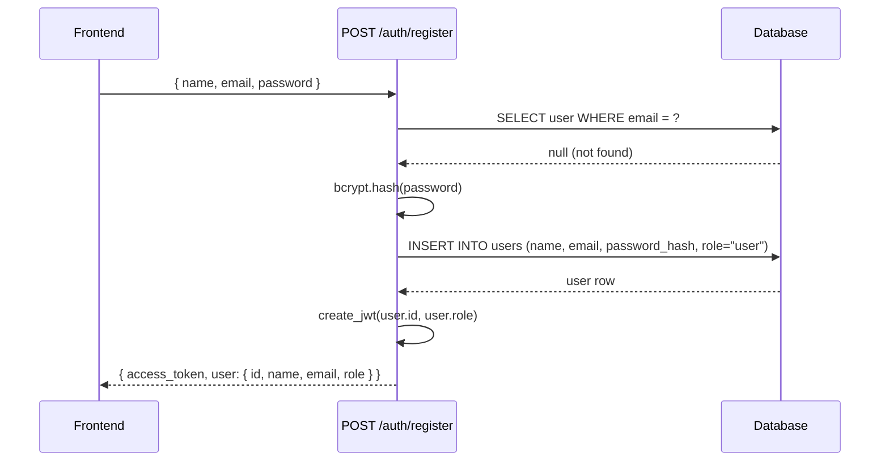
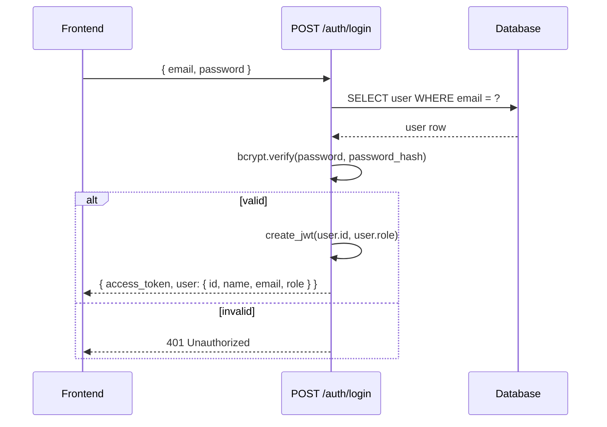
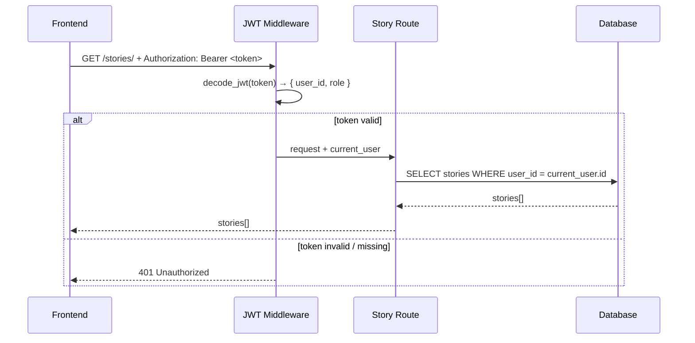
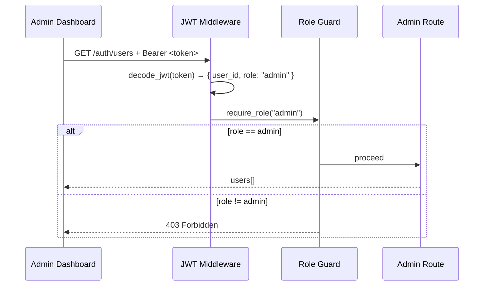

# Design Document: User Authentication & Management

## Overview

This feature adds a complete multi-user authentication and role-based access control system to the Cartoon Care application. It introduces secure email/password login with JWT tokens, a `User` model linked to all stories, and two distinct dashboards — one for regular users (parents/doctors) who manage their own stories, and one for admins who can oversee all users and content.

The design integrates cleanly with the existing FastAPI + SQLAlchemy async backend and React 19 + React Router v7 frontend without breaking any existing story generation functionality.

---

## Architecture

```mermaid
graph TD
    subgraph Frontend
        LP[Login Page]
        RP[Register Page]
        UD[User Dashboard]
        AD[Admin Dashboard]
        NB[Navbar]
        AC[AuthContext]
        PG[ProtectedRoute]
    end

    subgraph Backend
        AR[/auth/* routes]
        SR[/stories/* routes]
        MW[JWT Middleware]
        RBAC[Role Guard]
        AS[Auth Service]
        SS[Story Service]
    end

    subgraph Database
        UT[(users table)]
        ST[(stories table)]
        SPT[(story_pages table)]
    end

    LP -->|POST /auth/login| AR
    RP -->|POST /auth/register| AR
    UD -->|GET /stories/ + POST /stories/generate| SR
    AD -->|GET /auth/users + DELETE /stories/:id| AR

    AR --> MW
    SR --> MW
    MW --> RBAC
    RBAC --> AS
    RBAC --> SS

    AS --> UT
    SS --> ST
    ST --> SPT
    ST -->|user_id FK| UT

    AC -->|stores JWT| LP
    AC -->|provides user| PG
    PG -->|guards| UD
    PG -->|guards| AD
```

---

## Sequence Diagrams

### Registration Flow



### Login Flow



### Authenticated Story Request Flow



### Admin Access Flow



---

## Components and Interfaces

### Backend Components

#### AuthService

**Purpose**: Handles all authentication business logic — registration, login, token creation, and user lookup.

**Interface**:
```python
class AuthService:
    async def register_user(db: AsyncSession, data: RegisterRequest) -> User
    async def authenticate_user(db: AsyncSession, email: str, password: str) -> User | None
    async def get_user_by_id(db: AsyncSession, user_id: int) -> User | None
    async def get_all_users(db: AsyncSession) -> list[User]
    async def delete_user(db: AsyncSession, user_id: int) -> bool
```

**Responsibilities**:
- Hash passwords with bcrypt before storing
- Verify passwords during login
- Raise `HTTPException(409)` if email already registered
- Never return `password_hash` in any response

#### JWTService

**Purpose**: Creates and validates JWT access tokens.

**Interface**:
```python
class JWTService:
    def create_access_token(data: dict, expires_delta: timedelta) -> str
    def decode_access_token(token: str) -> dict  # raises if invalid/expired
```

**Responsibilities**:
- Sign tokens with `SECRET_KEY` from settings using HS256
- Embed `sub` (user_id as string), `role`, and `exp` claims
- Raise `HTTPException(401)` on invalid or expired tokens

#### JWT Middleware / Dependencies

**Purpose**: FastAPI dependency functions that extract and validate the current user from the `Authorization` header.

**Interface**:
```python
async def get_current_user(
    token: str = Depends(oauth2_scheme),
    db: AsyncSession = Depends(get_db)
) -> User

async def require_admin(current_user: User = Depends(get_current_user)) -> User
```

**Responsibilities**:
- Parse `Bearer <token>` from the `Authorization` header
- Decode and validate the JWT
- Load the user from the database
- `require_admin` raises `403` if `current_user.role != "admin"`

#### Auth Routes (`/auth/*`)

**Purpose**: HTTP endpoints for registration, login, logout, and user management.

**Interface**:
```
POST   /auth/register       → RegisterRequest  → TokenResponse
POST   /auth/login          → LoginRequest     → TokenResponse
POST   /auth/logout         → (no body)        → { message }
GET    /auth/me             → (auth header)    → UserResponse
GET    /auth/users          → (admin only)     → list[UserResponse]
DELETE /auth/users/{id}     → (admin only)     → 204
```

---

### Frontend Components

#### AuthContext

**Purpose**: React context that holds the authenticated user state and exposes auth actions globally.

**Interface**:
```typescript
interface AuthContextValue {
  user: User | null
  token: string | null
  login(email: string, password: string): Promise<void>
  register(name: string, email: string, password: string): Promise<void>
  logout(): void
  isAdmin: boolean
  isLoading: boolean
}
```

**Responsibilities**:
- Persist JWT in `localStorage`
- Restore session on page reload by reading `localStorage`
- Attach `Authorization: Bearer <token>` to all API requests via the `client.js` helper
- Clear token and user on logout

#### ProtectedRoute

**Purpose**: Wrapper component that redirects unauthenticated users to `/login` and optionally enforces admin-only access.

**Interface**:
```typescript
interface ProtectedRouteProps {
  children: ReactNode
  adminOnly?: boolean  // if true, redirect non-admins to /dashboard
}
```

#### LoginPage / RegisterPage

**Purpose**: Clean, minimal forms for authentication.

**Responsibilities**:
- Validate inputs client-side before submitting
- Display server-side error messages inline
- Redirect to appropriate dashboard after success (`/dashboard` for users, `/admin` for admins)
- Link between login ↔ register pages

#### UserDashboard

**Purpose**: The main page for authenticated parents/doctors.

**Responsibilities**:
- Show the story generation form (existing `StoryForm` component reused)
- List only the current user's stories
- Allow viewing and downloading their own stories

#### AdminDashboard

**Purpose**: Management interface for admins.

**Responsibilities**:
- List all registered users with their story counts
- List all stories across all users
- Delete any story or user
- No story generation form (admins manage, not generate)

---

## Data Models

### User Model (new)

```python
class User(Base):
    __tablename__ = "users"

    id           = Column(Integer, primary_key=True, index=True)
    name         = Column(String(100), nullable=False)
    email        = Column(String(255), nullable=False, unique=True, index=True)
    password_hash = Column(String(255), nullable=False)
    role         = Column(String(20), nullable=False, default="user")
    # role values: "user" | "admin"
    created_at   = Column(DateTime, default=lambda: datetime.now(timezone.utc))

    stories      = relationship("Story", back_populates="owner", cascade="all, delete")
```

**Validation Rules**:
- `email` must be unique across all users
- `role` must be one of `"user"` or `"admin"`
- `password_hash` is never exposed in API responses

### Story Model (modified)

The existing `Story` model gains one new column and a relationship back to `User`:

```python
# Added to existing Story model:
user_id = Column(Integer, ForeignKey("users.id"), nullable=False, index=True)
owner   = relationship("User", back_populates="stories")
```

**Migration note**: Existing stories in the database have no `user_id`. A migration script will set `user_id` to a default admin user's ID for all pre-existing rows before enforcing `nullable=False`.

### API Schemas (new)

```python
class RegisterRequest(BaseModel):
    name: str = Field(..., min_length=1, max_length=100)
    email: EmailStr
    password: str = Field(..., min_length=8, max_length=128)

class LoginRequest(BaseModel):
    email: EmailStr
    password: str

class TokenResponse(BaseModel):
    access_token: str
    token_type: str = "bearer"
    user: UserResponse

class UserResponse(BaseModel):
    id: int
    name: str
    email: str
    role: str
    created_at: datetime

    class Config:
        from_attributes = True
```

---

## Algorithmic Pseudocode

### Registration Algorithm

```pascal
PROCEDURE register_user(db, data: RegisterRequest)
  INPUT: db session, registration data
  OUTPUT: TokenResponse or HTTP error

  SEQUENCE
    // Check uniqueness
    existing ← db.query(User).filter(email = data.email).first()
    IF existing IS NOT NULL THEN
      RAISE HTTPException(409, "Email already registered")
    END IF

    // Hash password
    password_hash ← bcrypt.hash(data.password, rounds=12)

    // Persist user
    user ← User(name=data.name, email=data.email,
                password_hash=password_hash, role="user")
    db.add(user)
    AWAIT db.commit()
    AWAIT db.refresh(user)

    // Issue token
    token ← create_access_token({ sub: str(user.id), role: user.role })

    RETURN TokenResponse(access_token=token, user=UserResponse.from_orm(user))
  END SEQUENCE
END PROCEDURE
```

**Preconditions:**
- `data.email` is a valid email format (validated by Pydantic `EmailStr`)
- `data.password` is at least 8 characters

**Postconditions:**
- A new `User` row exists in the database
- `password_hash` is a bcrypt hash, never the raw password
- A valid JWT is returned

### Login Algorithm

```pascal
PROCEDURE authenticate_user(db, email, password)
  INPUT: db session, email string, password string
  OUTPUT: User or None

  SEQUENCE
    user ← db.query(User).filter(email = email).first()

    IF user IS NULL THEN
      RETURN None  // user not found
    END IF

    IF NOT bcrypt.verify(password, user.password_hash) THEN
      RETURN None  // wrong password
    END IF

    RETURN user
  END SEQUENCE
END PROCEDURE

PROCEDURE login(db, data: LoginRequest)
  INPUT: db session, login credentials
  OUTPUT: TokenResponse or HTTP 401

  SEQUENCE
    user ← authenticate_user(db, data.email, data.password)

    IF user IS NULL THEN
      RAISE HTTPException(401, "Invalid email or password")
      // Note: same message for both cases — prevents user enumeration
    END IF

    token ← create_access_token({ sub: str(user.id), role: user.role })
    RETURN TokenResponse(access_token=token, user=UserResponse.from_orm(user))
  END SEQUENCE
END PROCEDURE
```

**Preconditions:**
- `email` and `password` are non-empty strings

**Postconditions:**
- Returns a JWT only when both email exists AND password matches
- Error message is identical for "not found" and "wrong password" (security: no enumeration)

### JWT Token Algorithm

```pascal
PROCEDURE create_access_token(data: dict, expires_delta: timedelta = 60 minutes)
  INPUT: payload dict, optional expiry duration
  OUTPUT: signed JWT string

  SEQUENCE
    payload ← copy(data)
    expire ← utcnow() + expires_delta
    payload["exp"] ← expire
    token ← jwt.encode(payload, SECRET_KEY, algorithm="HS256")
    RETURN token
  END SEQUENCE
END PROCEDURE

PROCEDURE decode_access_token(token: str)
  INPUT: JWT string
  OUTPUT: payload dict or raises HTTPException

  SEQUENCE
    TRY
      payload ← jwt.decode(token, SECRET_KEY, algorithms=["HS256"])
      user_id ← payload.get("sub")
      IF user_id IS NULL THEN
        RAISE HTTPException(401, "Invalid token")
      END IF
      RETURN payload
    CATCH JWTExpiredSignatureError
      RAISE HTTPException(401, "Token expired")
    CATCH JWTError
      RAISE HTTPException(401, "Invalid token")
    END TRY
  END SEQUENCE
END PROCEDURE
```

**Loop Invariants**: N/A (no loops)

**Preconditions:**
- `SECRET_KEY` is a non-empty string loaded from environment
- `data` contains at minimum `{ "sub": user_id_string, "role": role_string }`

**Postconditions:**
- `create_access_token` always returns a string
- `decode_access_token` either returns a valid payload dict or raises `HTTPException(401)`

### Story Isolation Algorithm

```pascal
PROCEDURE get_user_stories(db, current_user: User)
  INPUT: db session, authenticated user
  OUTPUT: list of Story

  SEQUENCE
    IF current_user.role = "admin" THEN
      // Admins see everything
      stories ← db.query(Story).order_by(Story.created_at.desc()).all()
    ELSE
      // Regular users see only their own
      stories ← db.query(Story)
                   .filter(Story.user_id = current_user.id)
                   .order_by(Story.created_at.desc())
                   .all()
    END IF

    RETURN stories
  END SEQUENCE
END PROCEDURE
```

**Preconditions:**
- `current_user` is a valid, authenticated `User` object (guaranteed by `get_current_user` dependency)

**Postconditions:**
- A regular user NEVER receives stories belonging to another user
- An admin receives all stories

---

## Key Functions with Formal Specifications

### `get_current_user(token, db)` — FastAPI Dependency

```python
async def get_current_user(
    token: str = Depends(oauth2_scheme),
    db: AsyncSession = Depends(get_db)
) -> User
```

**Preconditions:**
- HTTP request contains `Authorization: Bearer <token>` header
- `token` is a non-empty string

**Postconditions:**
- Returns a `User` ORM object if token is valid and user exists in DB
- Raises `HTTPException(401)` if token is missing, malformed, or expired
- Raises `HTTPException(401)` if the user_id in the token no longer exists in DB

### `require_admin(current_user)` — FastAPI Dependency

```python
async def require_admin(current_user: User = Depends(get_current_user)) -> User
```

**Preconditions:**
- `current_user` is a valid authenticated user (guaranteed by `get_current_user`)

**Postconditions:**
- Returns `current_user` unchanged if `current_user.role == "admin"`
- Raises `HTTPException(403, "Admin access required")` otherwise

### `create_story_record(db, request, current_user)` — Modified

The existing `create_story_record` service function gains a `current_user` parameter:

```python
async def create_story_record(
    db: AsyncSession,
    request: StoryRequest,
    current_user: User
) -> Story
```

**Postconditions:**
- Created `Story` row has `user_id = current_user.id`
- All other behavior unchanged

---

## Error Handling

### Error Scenario 1: Duplicate Email on Register

**Condition**: `POST /auth/register` with an email that already exists in the `users` table.
**Response**: `HTTP 409 Conflict` — `{ "detail": "Email already registered" }`
**Recovery**: Frontend displays the error inline on the register form; user can try a different email or navigate to login.

### Error Scenario 2: Invalid Credentials on Login

**Condition**: Email not found, or password does not match the stored hash.
**Response**: `HTTP 401 Unauthorized` — `{ "detail": "Invalid email or password" }`
**Recovery**: Frontend displays the error inline; same message for both cases to prevent user enumeration.

### Error Scenario 3: Missing or Expired JWT

**Condition**: A protected route is called without an `Authorization` header, or with an expired token.
**Response**: `HTTP 401 Unauthorized` — `{ "detail": "Token expired" }` or `"Invalid token"`
**Recovery**: Frontend's `AuthContext` catches 401 responses globally, clears the stored token, and redirects to `/login`.

### Error Scenario 4: Insufficient Role

**Condition**: A `role="user"` account attempts to access an admin-only endpoint (e.g., `GET /auth/users`).
**Response**: `HTTP 403 Forbidden` — `{ "detail": "Admin access required" }`
**Recovery**: Frontend's `ProtectedRoute` with `adminOnly=true` prevents navigation to admin pages; the 403 is a backend safety net.

### Error Scenario 5: Cross-User Story Access

**Condition**: A user attempts to access `GET /stories/{id}` for a story that belongs to another user.
**Response**: `HTTP 404 Not Found` — `{ "detail": "Story not found" }`
**Recovery**: Returning 404 (not 403) avoids leaking the existence of other users' stories.

---

## Testing Strategy

### Unit Testing Approach

- Test `AuthService.register_user` with valid data, duplicate email, and weak password
- Test `AuthService.authenticate_user` with correct credentials, wrong password, and unknown email
- Test `JWTService.create_access_token` and `decode_access_token` with valid, expired, and tampered tokens
- Test `get_user_stories` returns only the requesting user's stories for `role="user"`, and all stories for `role="admin"`

### Property-Based Testing Approach

**Property Test Library**: `hypothesis` (Python)

- **Password hashing**: For any password string `p`, `bcrypt.verify(p, bcrypt.hash(p))` is always `True`
- **Token round-trip**: For any valid `user_id` and `role`, `decode(create(user_id, role)).sub == str(user_id)` always holds
- **Story isolation**: For any two distinct users `u1` and `u2`, stories returned for `u1` never contain a story with `user_id == u2.id`

### Integration Testing Approach

- Full register → login → generate story → list stories flow using `httpx.AsyncClient` against a test SQLite database
- Admin login → list all users → delete user flow
- Verify that deleting a user cascades and removes their stories

---

## Security Considerations

- **Password storage**: bcrypt with cost factor 12; raw passwords are never logged or stored
- **JWT secret**: `SECRET_KEY` loaded from `.env`, never hardcoded; minimum 32 characters recommended
- **Token expiry**: Access tokens expire after 60 minutes; no refresh token in v1 (acceptable for this use case)
- **User enumeration prevention**: Login returns the same error message whether the email is unknown or the password is wrong
- **Story access control**: Story endpoints filter by `user_id` at the database query level, not just in application logic — a compromised route handler cannot accidentally leak data
- **CORS**: Existing CORS config already restricts origins to `localhost:5173` and `localhost:3000`
- **Admin bootstrap**: The first admin account is created via a CLI seed script or by manually setting `role="admin"` in the database; there is no self-service admin registration endpoint

---

## Performance Considerations

- `email` column on `users` table has a database index (`index=True`) for fast login lookups
- `user_id` column on `stories` table has a database index for fast per-user story queries
- JWT validation is in-memory (no database call) for the token decode step; only one DB call is made to load the user object
- bcrypt cost factor 12 adds ~250ms per login — acceptable for auth, and prevents brute-force attacks

---

## Dependencies

### Backend (new)

| Package | Purpose |
|---|---|
| `python-jose[cryptography]` | JWT creation and validation |
| `passlib[bcrypt]` | Password hashing with bcrypt |
| `python-multipart` | Required by FastAPI for OAuth2 form support |
| `pydantic[email]` | `EmailStr` validation in schemas |

### Frontend (new)

No new npm packages required. JWT is stored in `localStorage` and attached via the existing `client.js` helper. React Context API (built-in) handles global auth state.

### Environment Variables (new)

```
SECRET_KEY=<random-32+-char-string>
ACCESS_TOKEN_EXPIRE_MINUTES=60
```
